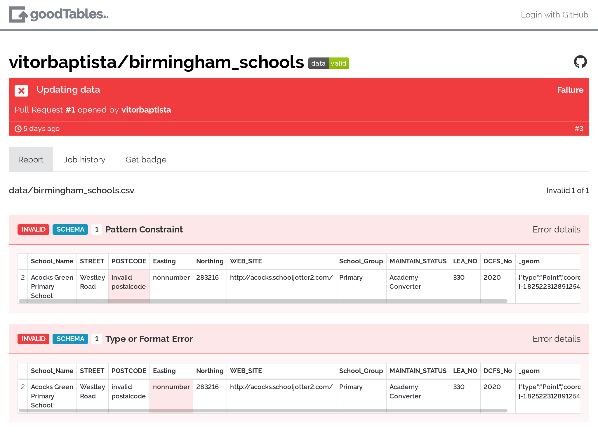

# goodtables.io: Continuous tabular data validation

Goodtables increases your confidence in your data by performing a number of
checks on it. It is able to validate things like:

* Is my CSV valid?
* Do all rows have the same number of columns?
* Are all dates valid?
* Is there any invalid e-mail?

If any of the checks fail, goodtables generates a report telling you which and
where the errors occurred.

[][bhx-schools]

By adding goodtables to your data publishing workflow, you'll make sure your
data is free from these types of errors.

## Features

* **Structural checks**: Ensure that there are no empty rows, no blank headers, etc.
* **Content checks**: Ensure that the values have the correct types ("string", "number", "date", etc.), that their format is valid ("string must be an e-mail"), and that they respect the constraints ("age must be a number greater than 18").
* **Support for multiple tabular formats**: CSV, Excel, LibreOffice, Data Package, etc.
* **Automatically validate on every update on GitHub**

## Table of Contents

```eval_rst
.. toctree::
   :maxdepth: 2

   getting_started
   configuring
   goodtables_yml
```


[bhx-schools]: https://goodtables.io/github/vitorbaptista/birmingham_schools "Birmingham Schools validation report"
